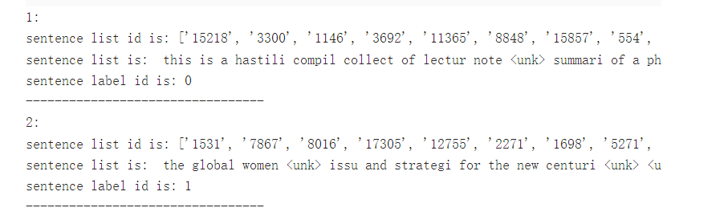
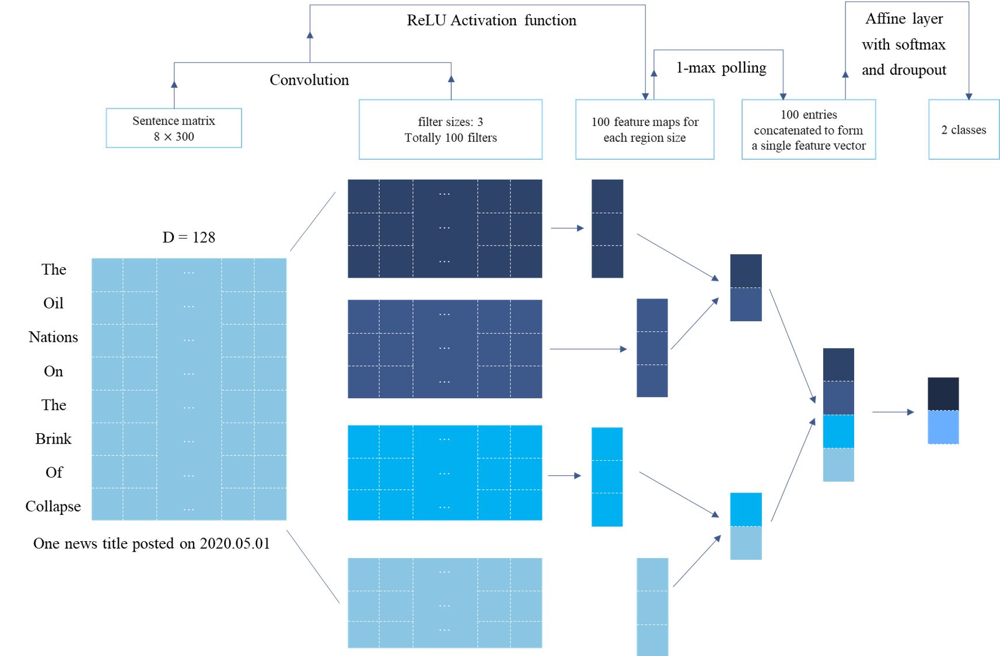

【AI达人创造营第二期】文本情感分析（基于飞桨)
---

# 一、项目背景介绍

在我国电子商务飞快发展的背景下，基本上所有的电子商务网站都支持消费者对产品的相关内容（商品、服务、卖家）等进行打分和发表评论。客户可以通过网络进行沟通和交流，在网络平台上发布大量的留言和评论，这已经成为互联网的一种流行形式，而这种形势必然给互联网带来海量的信息。

对于**卖家**来说，可以从评论信息中获取客户的实际需求，以改善产品品质，提高自身的竞争力。对于**客户**来说，可以借鉴别人的购买历史以及评论信息，更好的辅助自己制定购买决策。此外，对于一些未知体验产品，客户可以通过网络来获取产品信息，特别是对一些未知的体验产品，客户为了降低自身的风险更加倾向于得到其他客户的意见和看法，这些评论对潜在的买家而言无疑是一笔财富，并以此作为决策的重要依据。 因此，通过利用数据挖掘技术针对客户的大量评论进行分析，可以挖掘出这些信息的特征，而得到的这些信息有利于生产商改进自身产品和改善相关的服务，提高商家的核心竞争力。本项目所选择的Multi-Domain Sentiment Dataset 数据库包含从 Amazon.com 获取的来自许多产品类型（域）的产品评论，希望通过借助该数据库实现NLP语言处理技术在对商品评论进行情感分析，了解文本情感分类的基本用法。

# 二、数据介绍

## 2.1 数据集简介

Multi-Domain Sentiment Dataset 包含从 Amazon.com 获取的来自许多产品类型（域）的产品评论。某些域（书籍和 DVD）有数十万条评论。其他（乐器）只有几百。评论包含星级评分（1 到 5 星），如果需要，可以将其转换为二进制标签。此页面包含有关数据的一些说明。

关于数据集的一些注意事项:
1. unprocessed 文件夹包含原始数据。
2. processed.acl 文件夹包含预处理和平衡的数据。也就是说，Blitzer 等人的格式。(ACL 2007)
3. processed.realvalued 包含了经过预处理和平衡的数据，但是有星数，而不仅仅是正数或负数。也就是说，Mansour 等人的格式。(NIPS 2009)

    预处理数据为每个文档一行，每行格式如下：
    
    feature:<count> .... feature:<count> #label#:<label>
  
    标签总是在每个文件的末尾线。
4. 每个目录对应一个域。每个目录包含几个文件，我们简要介绍一下：
    - all.review -- 该域的所有评论，以其原始格式
    - positive.review -- 正面评论
    - negative.review -- 负面评论
    - unlabeled.review -- 未标记的评论
    - processed.review -- 预处理评论（见下文）
    - processing.review.balanced -- 预处理评论，在正面和负面之间均衡。

5. 虽然正面和负面文件包含正面和负面评论，但这些不一定是任何引用论文中使用的分割。他们只是在那里尽可能地进行初始分裂。
6. 每个（未处理的）文件都包含一个用于对评论进行编码的伪 XML 方案。大多数字段都是不言自明的。评论有一个不是很独特的唯一 ID 字段。如果它有两个唯一的 id 字段，则忽略仅包含一个数字的那个。总有一些我们可能忽略的小细节。如果您在阅读论文和本页后有任何疑问，请告诉 Mark Dredze 或 John Blitzer。


```python
data_path = 'data/'
# all_path = data_path + 'all.review'
positive_path = data_path + 'positive.review'
negative_path = data_path + 'negative.review'
# unbalance_path = data_path + 'unbalanced.review'
# test_path = data_path + 'processed.review.balanced'
# processed_path = data_path + 'processed.review'


def read_dataset(dataset_path):
    # ========== 可以通过下述代码查看 txt 文件的编码
    # import chardet
    # f = open(positive_path,'rb')
    # data = f.read()
    # print(chardet.detect(data))
    # =============================================

    with open(dataset_path, encoding = 'ISO-8859-1') as f:
        train = f.readlines()
    
    # 进行简单的筛选，将小于 15 个单词的句子进行剔除
    train = [i for i in train if not i.startswith('<')]
    train = [i for i in train if len(i.split(' ')) >= 15]

    return train
```

## 2.2 选取数据集
    
考虑到数据集数据量较大，此处我们进选择其中的一小部分：processed_stars/electronics 文件夹中的数据作为本项目的数据进行分析。

- 加载数据 

    通过初步查看，发现数据集中有许多无效的评论，因此此处进行了简单筛选，剔除小于 `15` 个单词的评论，为了便利，此项目进队 `positve` 和 `negative` 进行识别和分析。


```python
positive_dataset = read_dataset(positive_path)
negative_dataset = read_dataset(negative_path)

print('The length of Positive dataset: ', len(positive_dataset))
print('The length of Negative dataset: ', len(negative_dataset))
```

    The length of Positive dataset:  2224
    The length of Negative dataset:  2428


可以发现，得到了 `2224` 条积极评论，`2428` 条负向评论。

### 2.2.2 文本处理方法

由于本项目所选数据为英语，因此选用 `NLTK` 库来处理我们的英语文本数据，而在借助 `NLTK` 处理句子时，需要加载其自定义的 `tokenizer`，由于无法直接下载，此处我们选择将 `punkt.zip` 上传至 `/home/aistudio/nltk_data/tokenizers/` 文件路径，以保证 `NLTK` 可以正常处理数据。该压缩包可以通过网上查找得到。

    
    
首先，使用了词云对评论进行了可视化分析，如下图所示：
    

    


```python
!pip install wordcloud
```

    Looking in indexes: https://pypi.tuna.tsinghua.edu.cn/simple
    Collecting wordcloud
      Downloading https://pypi.tuna.tsinghua.edu.cn/packages/1b/06/0516bdba2ebdc0d5bd476aa66f94666dd0ad6b9abda723fdf28e451db919/wordcloud-1.8.1-cp37-cp37m-manylinux1_x86_64.whl (366 kB)
         |████████████████████████████████| 366 kB 2.0 MB/s            
    [?25hRequirement already satisfied: numpy>=1.6.1 in /opt/conda/envs/python35-paddle120-env/lib/python3.7/site-packages (from wordcloud) (1.19.5)
    Requirement already satisfied: matplotlib in /opt/conda/envs/python35-paddle120-env/lib/python3.7/site-packages (from wordcloud) (2.2.3)
    Requirement already satisfied: pillow in /opt/conda/envs/python35-paddle120-env/lib/python3.7/site-packages (from wordcloud) (8.2.0)
    Requirement already satisfied: python-dateutil>=2.1 in /opt/conda/envs/python35-paddle120-env/lib/python3.7/site-packages (from matplotlib->wordcloud) (2.8.2)
    Requirement already satisfied: cycler>=0.10 in /opt/conda/envs/python35-paddle120-env/lib/python3.7/site-packages (from matplotlib->wordcloud) (0.10.0)
    Requirement already satisfied: six>=1.10 in /opt/conda/envs/python35-paddle120-env/lib/python3.7/site-packages (from matplotlib->wordcloud) (1.16.0)
    Requirement already satisfied: pyparsing!=2.0.4,!=2.1.2,!=2.1.6,>=2.0.1 in /opt/conda/envs/python35-paddle120-env/lib/python3.7/site-packages (from matplotlib->wordcloud) (3.0.7)
    Requirement already satisfied: pytz in /opt/conda/envs/python35-paddle120-env/lib/python3.7/site-packages (from matplotlib->wordcloud) (2019.3)
    Requirement already satisfied: kiwisolver>=1.0.1 in /opt/conda/envs/python35-paddle120-env/lib/python3.7/site-packages (from matplotlib->wordcloud) (1.1.0)
    Requirement already satisfied: setuptools in /opt/conda/envs/python35-paddle120-env/lib/python3.7/site-packages (from kiwisolver>=1.0.1->matplotlib->wordcloud) (41.4.0)
    Installing collected packages: wordcloud
    Successfully installed wordcloud-1.8.1
    WARNING: You are using pip version 21.3.1; however, version 22.0.3 is available.
    You should consider upgrading via the '/opt/conda/envs/python35-paddle120-env/bin/python -m pip install --upgrade pip' command.


```python
from wordcloud import WordCloud 
import matplotlib.pyplot as plt 

results = {}

test_words = ' '.join(positive_dataset)

wordcloud = WordCloud(collocations = False, 
    background_color = 'white',
    width = 2800,
    height = 1600
    ).generate(test_words)

plt.figure()
plt.imshow(wordcloud, interpolation='bilinear')
plt.axis('off')
plt.show()
```


    

    


可以发现，不出所料，产品评论中出现最多的几个词分别为：`book`, `read`, `time`。
    
## 2.3 数据预处理
    
1. 数据标签标注
    
在进行分析之前，需要对数据的标签进行处理，首先对 `positive` 和 `negative` 样本进行标注，标注规则为：
    
- positive: 1
- negative: 0
   


```python
import os 
import pandas as pd 

export_path = 'Senti_dataset/'
all_data_path = export_path + 'all.csv'
# 把生成的数据列表都放在自己的总类别文件夹中

if os.path.exists(all_data_path):
    all_pd = pd.read_csv(all_data_path, encoding = 'utf-8', index_col = 0)
else:
    pos_pd = pd.DataFrame(positive_dataset, columns = ['Sentences'])
    pos_pd['Label'] = 1 # Positive

    neg_pd = pd.DataFrame(negative_dataset, columns = ['Sentences'])
    neg_pd['Label'] = 0

    all_pd = pd.concat([pos_pd, neg_pd], axis = 0)
    all_pd = all_pd.sample(frac=1).reset_index(drop=True) # 打散数据
    all_pd.to_csv(all_data_path, encoding = 'utf-8')
```

2. 构建数据字典
   


```python
import nltk 

def create_dic(df, dict_path):
    with open(dict_path, 'w') as f:
        f.seek(0)
        f.truncate()

    dict_set = set()
    
    contents = ' '.join(df['Sentences'].to_list())

    tokens = nltk.word_tokenize(contents)
    s = nltk.stem.SnowballStemmer('english')
    clean_text = [s.stem(ws) for ws in tokens]

    for s in clean_text:
        dict_set.add(s)

    dict_list = []
    i = 0
    for s in dict_set:
        dict_list.append([s, i])
        i += 1
    
    dict_txt = dict(dict_list)
    end_dict = {'<unk>': i, '<pad>': i+1}
    dict_txt.update(end_dict)

    with open(dict_path, 'w', encoding='utf-8') as f:
        f.write(str(dict_txt))
    
    print('The word dictionary has been created successfully!')

# dict_path = export_path + 'word2idx.txt'
# create_dic(all_pd, dict_path)
```

 
3. 生成单词表
    


```python
import os

def load_vocab(dict_path):
    if os.path.exists(dict_path) == False:
        create_dic(all_pd, dict_path)

    with open(dict_path, 'r', encoding = 'utf-8') as fr:
        vocab = eval(fr.read())
    return vocab

vocab = load_vocab(dict_path)
vocab
```


    {'synonym': 0,
     'juri': 1,
     'websit': 2,
     'sharp-tongu': 3,
     'frequent': 4,
     '..i': 5,
     'destroy': 6,
     'variabl': 7,
     'pipher': 8,
     'shawn': 9,
     'counter': 10,
     'shrift': 11,
     'haul': 12,
     'encyclopaed': 13,
     'papel': 14,
     'readng': 15,
     'simpl': 16,
     'cross-countri': 17,
     'crossword': 18,
     '8-12': 19,
     'salad': 20,
     'fast-pac': 21,
     'portal': 22,
     'curb': 23,
     'misstat': 24,
     'infedil': 25,
     'enamor': 26,
     'lens': 27,
     'chargeback': 28,
     'hippo': 29,
     'rylant': 30,
     'patho': 31,
     'sens': 32,
     'nois': 33,
     'gorbachev': 34,
     'dentistri': 35,
     'damor': 36,
     'likelihood': 37,
     'conspicu': 38,
     'hop': 39,
     'pittsburgh': 40,
     'kabbalah': 41,
     'diagram': 42,
     '2.there': 43,
     'slightest': 44,
     'elopement.': 45,
     '111': 46,
     'attest': 47,
     'document': 48,
     'stultifi': 49,
     'lower': 50,
     'says\x1a': 51,
     'fiance': 52,
     'grovel': 53,
     '40s': 54,
     'oldster': 55,
     'unreli': 56,
     'rwanda': 57,
     'thecultur': 58,
     '80,000': 59,
     'unfett': 60,
     'beep': 61,
     'bergey': 62,
     'state-sponsor': 63,
     'rosenth': 64,
     'torrijos.who': 65,
     '5': 66,
     'epilogu': 67,
     'embolden': 68,
     'palat': 69,
     'dreamlik': 70,
     'bioweapon': 71,
     'fleurberg': 72,
     'certain': 73,
     'grate': 74,
     'forest': 75,
     'certain\x1aconclus': 76,
     'many\x1aextrem': 77,
     'osteen': 78,
     'habsburg': 79,
     'collar': 80,
     'famish': 81,
     'priceless': 82,
     'unsustain': 83,
     '*think*': 84,
     'arm': 85,
     'normal\x1a': 86,
     'restitut': 87,
     'rabbin': 88,
     'unengag': 89,
     'mat': 90,
     'mrs': 91,
     'hitchcock': 92,
     'tyre': 93,
     'cumbersom': 94,
     'pure-literari': 95,
     'drive-bi': 96,
     'nine': 97,
     'over-emphas': 98,
     'diari': 99,
     'algorithm': 100,
     "o'otham": 101,
     'mathematician': 102,
     '7.8.05': 103,
     'teri': 104,
     'malkin': 105,
     'hanukkah': 106,
     'language\x1a': 107,
     'revis': 108,
     'kelp': 109,
     'hard-to-put-down': 110,
     'targ': 111,
     'burden': 112,
     'stellar': 113,
     'fact': 114,
     'greenblatt': 115,
     'all-se': 116,
     'hypothes': 117,
     '161': 118,
     'underw': 119,
     'branden': 120,
     'comments\x1a': 121,
     'mcgovern': 122,
     'partin': 123,
     'apologet': 124,
     'larkcom': 125,
     'lyn': 126,
     'lacklust': 127,
     'katschei': 128,
     'ostens': 129,
     'feather': 130,
     'surgeon': 131,
     'fixat': 132,
     'less-abl': 133,
     'academ': 134,
     'feud': 135,
     'analysi': 136,
     'infrar': 137,
     'retri': 138,
     '7/2005': 139,
     'damon': 140,
     'impli': 141,
     'manhatten': 142,
     'personal\x1a': 143,
     'out-of-luck': 144,
     'syllabl': 145,
     'pronoun': 146,
     'inquiri': 147,
     'shake': 148,
     'bart': 149,
     'brick': 150,
     'legal': 151,
     'marvel': 152,
     'irrepress': 153,
     'frasier': 154,
     'materialist': 155,
     'defac': 156,
     'lass': 157,
     'theory-ori': 158,
     '.if': 159,
     'wacki': 160,
     'interrupt': 161,
     'cult-lik': 162,
     'way': 163,
     'vinton': 164,
     'theall': 165,
     'vorkosigan': 166,
     'insuffer': 167,
     'hillari': 168,
     'miniseri': 169,
     'said': 170,
     'hole': 171,
     'pathetic-excuss': 172,
     'blue-collar': 173,
     'bumpi': 174,
     'lennox': 175,
     'prophesi': 176,
     'slant': 177,
     'marri': 178,
     'stifl': 179,
     'sweep': 180,
     'blade': 181,
     'join': 182,
     'ok.': 183,
     'untruth': 184,
     'understat': 185,
     'complic': 186,
     'staf': 187,
     'systemat': 188,
     'hamburg': 189,
     'neural': 190,
     'hypocrisi': 191,
     'statement': 192,
     'butter': 193,
     'dominick': 194,
     'pillow': 195,
     'mingl': 196,
     'swear': 197,
     'globals/ref': 198,
     'tyler': 199,
     'step-by-step': 200,
     'just': 201,
     'scarlett': 202,
     'arabia': 203,
     'player': 204,
     'varous': 205,
     'jew': 206,
     'histor': 207,
     'german-pomeranian': 208,
     'abras': 209,
     'demograph': 210,
     'pic': 211,
     'breviari': 212,
     'liftig': 213,
     'ineffect': 214,
     'virgil': 215,
     'would-b': 216,
     'amor': 217,
     'dallair': 218,
     'litani': 219,
     'slow-go': 220,
     'honor': 221,
     'round': 222,
     'bingo': 223,
     'mulch': 224,
     '-incred': 225,
     'reigns.\x1a\x1a': 226,
     'millar': 227,
     'structur': 228,
     'declar': 229,
     'antonio': 230,
     'scalabl': 231,
     'karloff': 232,
     '-10': 233,
     'suppress': 234,
     'yack': 235,
     'tablet': 236,
     'timespan': 237,
     'rodrick': 238,
     'buddha': 239,
     'bother': 240,
     'sigmund': 241,
     'scandl': 242,
     'decid': 243,
     '*btw': 244,
     'small-mid': 245,
     'saxoni': 246,
     'al-qaeda': 247,
     '1980': 248,
     'octavius': 249,
     'hannigan': 250,
     'weather': 251,
     'ettus': 252,
     'elena': 253,
     'hum': 254,
     'these': 255,
     'help': 256,
     'resouc': 257,
     '7': 258,
     'hogath': 259,
     'monti': 260,
     'alik': 261,
     'amend': 262,
     'lovabl': 263,
     'london': 264,
     'two-by-two': 265,
     'clad': 266,
     'incest': 267,
     'braugher': 268,
     'peril': 269,
     'choir': 270,
     'rather': 271,
     'insur': 272,
     'legitim': 273,
     'bolster': 274,
     'de': 275,
     'though': 276,
     'man-hat': 277,
     'unquestion': 278,
     'synopsi': 279,
     'geographi': 280,
     'betsy-bug': 281,
     'warm-fuzzi': 282,
     'hong': 283,
     'cassidi': 284,
     'inner': 285,
     '1930': 286,
     'patricia': 287,
     'perus': 288,
     'tabl': 289,
     'dhun': 290,
     'seri': 291,
     'attention-seek': 292,
     'traine': 293,
     'sandler': 294,
     'maneuv': 295,
     'yap': 296,
     'ocd': 297,
     'bushido': 298,
     'grind': 299,
     'headstrong': 300,
     'jamieson': 301,
     'ladi': 302,
     'even\x1a': 303,
     'fifth': 304,
     'eso': 305,
     'suspend': 306,
     '200': 307,
     'helmsley': 308,
     'prudent': 309,
     '1204': 310,
     'treati': 311,
     'tank': 312,
     'option': 313,
     'pervers': 314,
     'hearti': 315,
     'studi': 316,
     'support': 317,
     'mickey': 318,
     'mainten': 319,
     'baedek': 320,
     'punishing\x1a': 321,
     'niffenegg': 322,
     'soul-bear': 323,
     'nut': 324,
     'mr': 325,
     '1979': 326,
     'pest': 327,
     'hyperemesi': 328,
     'comic': 329,
     'schama': 330,
     'underlin': 331,
     'skrull': 332,
     'elud': 333,
     'genocid': 334,
     'acceler': 335,
     'facet': 336,
     'braden': 337,
     'craig': 338,
     'fade': 339,
     'raptur': 340,
     'gushi': 341,
     'mumbo': 342,
     'he/sh': 343,
     'lynn': 344,
     'leash': 345,
     'startl': 346,
     'illumnati': 347,
     'pp.129-131': 348,
     'nocturn': 349,
     '41': 350,
     'concern': 351,
     'compil': 352,
     'healthcar': 353,
     '*i': 354,
     'count-down': 355,
     'backward': 356,
     'katharin': 357,
     'neolith': 358,
     'lack': 359,
     'overboard': 360,
     'fascist': 361,
     'heavily-popul': 362,
     'gorgeous': 363,
     'stackpol': 364,
     'coherent\x1a': 365,
     'been': 366,
     'evidence-bas': 367,
     'calhoun': 368,
     'linux': 369,
     'decoupled\x1a': 370,
     'sandra': 371,
     'reviv': 372,
     'odd': 373,
     'allig': 374,
     'passchendael': 375,
     'itself': 376,
     'j-b': 377,
     'must-read': 378,
     'jehovah': 379,
     'three-hour': 380,
     'pulpit': 381,
     'peddl': 382,
     'social': 383,
     'peggi': 384,
     'shamblin': 385,
     'high-abl': 386,
     'outrag': 387,
     'reconstructionist': 388,
     'braga': 389,
     'cobb': 390,
     'motley': 391,
     'airtim': 392,
     'seminari': 393,
     'ignit': 394,
     'hyper': 395,
     'playmat': 396,
     'referenc': 397,
     'catechist': 398,
     'shi': 399,
     'audiobook': 400,
     'demystifi': 401,
     'pregnant': 402,
     'dude': 403,
     'phone': 404,
     'skandier': 405,
     'startup': 406,
     'agon': 407,
     'influenti': 408,
     'physiocrat': 409,
     'term': 410,
     'come-back': 411,
     'stude': 412,
     'deliveri': 413,
     'then': 414,
     'language-learn': 415,
     'isi': 416,
     'brochur': 417,
     'chemistri': 418,
     'ensur': 419,
     'choos': 420,
     'call': 421,
     'pain-fre': 422,
     'boyd': 423,
     'benjamin': 424,
     'ned': 425,
     'arab': 426,
     'are': 427,
     'tumor': 428,
     'detroit': 429,
     '1906': 430,
     'surpis': 431,
     'buck': 432,
     'favorit': 433,
     'reciev': 434,
     'diabol': 435,
     'tom': 436,
     'relentless': 437,
     'barzini': 438,
     'dimension': 439,
     'business/oil': 440,
     'pizarro': 441,
     'ted': 442,
     'ivanho': 443,
     'fullest': 444,
     'level': 445,
     'adjust': 446,
     'monotonon': 447,
     '260': 448,
     'she-ocraci': 449,
     'lisa': 450,
     'shakespear': 451,
     'doped-up': 452,
     'prioriti': 453,
     'lesser': 454,
     'dt': 455,
     'accent': 456,
     'technology-savvi': 457,
     'fact\x1a': 458,
     'whyte': 459,
     'vice-presidenti': 460,
     'unto': 461,
     'roust': 462,
     'beta': 463,
     'church': 464,
     'lunch': 465,
     'billiard': 466,
     'probabl': 467,
     'gm': 468,
     'urgent': 469,
     'would': 470,
     'pike': 471,
     'troubl': 472,
     'manouv': 473,
     'thirty-year': 474,
     'j.f.groot': 475,
     'one-man': 476,
     'lovesick': 477,
     'reimer': 478,
     'letter': 479,
     'drawn': 480,
     'yore': 481,
     'spade': 482,
     'laissez-fair': 483,
     'convic': 484,
     'per': 485,
     'camus': 486,
     '.although': 487,
     'of\x1a': 488,
     'fraction': 489,
     'moneybal': 490,
     'unveil': 491,
     'al': 492,
     'scjp': 493,
     'sjoholm': 494,
     'hewlett-packard': 495,
     'happi': 496,
     'painstak': 497,
     'completist': 498,
     'jounrey': 499,
     'bryant': 500,
     'trite': 501,
     'shaddow': 502,
     '800+': 503,
     'brownsvill': 504,
     'simple-mind': 505,
     'hope': 506,
     'titur': 507,
     'improv': 508,
     'tunnel': 509,
     'verbatim': 510,
     'goldschneid': 511,
     'hid': 512,
     'beach': 513,
     'winger': 514,
     'geopolit': 515,
     'hyster': 516,
     'somoon': 517,
     'absurd': 518,
     'underdog': 519,
     'rose-color': 520,
     'sicken': 521,
     'gw': 522,
     'idea': 523,
     'make': 524,
     'menstruat': 525,
     'moon': 526,
     'hanniti': 527,
     '..but': 528,
     'murder': 529,
     'osborn': 530,
     'agnost': 531,
     'deduct': 532,
     'hes': 533,
     'laini': 534,
     '310-025': 535,
     'determin': 536,
     'jfk': 537,
     'tennant': 538,
     'pp.271-273': 539,
     'bufe': 540,
     'takeov': 541,
     'gal': 542,
     'common-sens': 543,
     'bad-guy': 544,
     "gen-x'er": 545,
     'operating\x1a': 546,
     'free': 547,
     'dungeon': 548,
     'abl': 549,
     'rice': 550,
     '19th': 551,
     'clumsi': 552,
     'clairvoy': 553,
     'authent': 554,
     'supplement': 555,
     'cattl': 556,
     'purest': 557,
     'tilli': 558,
     'powerpl': 559,
     'portug': 560,
     'technolog': 561,
     'evening/': 562,
     'pois': 563,
     'browni': 564,
     'wall': 565,
     'enthusiast': 566,
     'emphas': 567,
     'preston/child': 568,
     'extinct': 569,
     'single\x1a': 570,
     'busier': 571,
     'hienlein': 572,
     'pragu': 573,
     'fuhnman': 574,
     'weight': 575,
     '*and*': 576,
     'polyglot': 577,
     'provac': 578,
     'extra': 579,
     'percent': 580,
     'connelli': 581,
     'supermodel': 582,
     'prom': 583,
     'reassur': 584,
     'subsum': 585,
     'coke': 586,
     'underli': 587,
     'thick-pil': 588,
     'overstat': 589,
     '-clich': 590,
     'student': 591,
     'sumatra': 592,
     'presidenti': 593,
     'wolev': 594,
     'gahhhhhhh': 595,
     'ethiopia': 596,
     'hall': 597,
     'rumpel': 598,
     'lose': 599,
     'helena': 600,
     'belong': 601,
     'alarm': 602,
     'ver': 603,
     'interesting.a': 604,
     'insepar': 605,
     'generat': 606,
     'presenc': 607,
     'integ': 608,
     'es': 609,
     'fresco': 610,
     'pennsylvania': 611,
     'looks/sex': 612,
     'rinzler': 613,
     '77': 614,
     'consult': 615,
     'gelbspan': 616,
     'karl': 617,
     'hieroglyph': 618,
     'may': 619,
     'thwart': 620,
     'cheapest': 621,
     'liberalization.i': 622,
     'mid-80': 623,
     'elector': 624,
     'australia': 625,
     'outwit': 626,
     'nutrituion': 627,
     'laughabl': 628,
     'unsuccess': 629,
     'taker': 630,
     'mess': 631,
     'exual': 632,
     'wilso': 633,
     'shortcut': 634,
     'devious': 635,
     'overturn': 636,
     'shaq': 637,
     'semant': 638,
     'ricardo.in': 639,
     'pre-fiv': 640,
     'wetback': 641,
     'intuitive\x1a': 642,
     'wage': 643,
     'nicholaou': 644,
     'evolutionist': 645,
     'mx': 646,
     'start-up': 647,
     'foriegn': 648,
     'flesh': 649,
     'horc': 650,
     'mccarri': 651,
     'facin': 652,
     'ramaswami': 653,
     'kee': 654,
     'milk-cow': 655,
     'get.i': 656,
     'gerd': 657,
     'redempt': 658,
     'illumin': 659,
     'reprocess': 660,
     'run': 661,
     'conquest': 662,
     'liquor': 663,
     'self-publish': 664,
     'consciousness\x1a': 665,
     'extrasensori': 666,
     'pimpl': 667,
     'close.a': 668,
     'pardon': 669,
     'capit': 670,
     'book.it': 671,
     'catagori': 672,
     'beach-bag': 673,
     'travelogu': 674,
     'poison': 675,
     'despair': 676,
     'extent': 677,
     '222': 678,
     '-charli': 679,
     '.': 680,
     'rawlin': 681,
     'porti': 682,
     'poser': 683,
     'slipperi': 684,
     'occasion': 685,
     'bf': 686,
     'awak': 687,
     'victori': 688,
     'lon': 689,
     'shift': 690,
     'motorcycl': 691,
     'umpir': 692,
     'toe': 693,
     'deconstruction': 694,
     'colin': 695,
     'vegan': 696,
     'explan': 697,
     'marcus': 698,
     'farm-boy': 699,
     'aggreement': 700,
     'metali': 701,
     'acomplish': 702,
     'exceed': 703,
     'expound': 704,
     'dian': 705,
     'quad': 706,
     'armstrong': 707,
     'graceland': 708,
     'ot': 709,
     'csla': 710,
     'cardoza': 711,
     'put': 712,
     'mercuri': 713,
     'sex': 714,
     'entropi': 715,
     'festiv': 716,
     'deep': 717,
     'urbanist': 718,
     'booker': 719,
     'forgotten': 720,
     'drink': 721,
     'splendid': 722,
     'sketchi': 723,
     'sy': 724,
     'hippi': 725,
     'spur': 726,
     'neeli': 727,
     'hurri': 728,
     'especi': 729,
     'chemical/biolog': 730,
     'natali': 731,
     'israel': 732,
     'mouth': 733,
     'first-person': 734,
     'hamilton': 735,
     'bah': 736,
     'rip': 737,
     'triumvir': 738,
     'monoton': 739,
     'coauthor': 740,
     'eye': 741,
     'godfath': 742,
     'spielberg': 743,
     'anastassato': 744,
     'jk': 745,
     'unmask': 746,
     'wmds': 747,
     'nauseat': 748,
     'wilson': 749,
     'resarch': 750,
     'kara': 751,
     'fogarti': 752,
     'moveabl': 753,
     '178': 754,
     'demura': 755,
     'electrophil': 756,
     'conjectur': 757,
     'lewi': 758,
     'high-frequ': 759,
     'ninth-grad': 760,
     'jenkin': 761,
     'barbara': 762,
     'well-plac': 763,
     'gri': 764,
     'celin': 765,
     'intercom': 766,
     'pose': 767,
     'post-cold': 768,
     'unwind': 769,
     'subsequ': 770,
     'giuliani': 771,
     'sanitari': 772,
     'fought': 773,
     'be\x1a': 774,
     'anti-abort': 775,
     'shun': 776,
     'dive': 777,
     'vehement': 778,
     'throught': 779,
     'doe': 780,
     '224': 781,
     'taint': 782,
     'barad': 783,
     'bach': 784,
     'dip': 785,
     'lifer': 786,
     'subtleti': 787,
     'agaaiin': 788,
     'spectrum': 789,
     'personn': 790,
     'funda': 791,
     'team': 792,
     'comic-book': 793,
     'nucor': 794,
     'blaze': 795,
     'prosecut': 796,
     'mis-market': 797,
     'letdown': 798,
     'shadi': 799,
     'committe': 800,
     'anal': 801,
     'union': 802,
     'lonesom': 803,
     'ledford': 804,
     'romeo': 805,
     'rune': 806,
     'estimate.': 807,
     'leido': 808,
     'smoki': 809,
     'equat': 810,
     'ridden': 811,
     'imedi': 812,
     'crichton': 813,
     'grow': 814,
     'utilitarian': 815,
     'gape': 816,
     'papp': 817,
     'vbscript': 818,
     'foregoon': 819,
     'acn': 820,
     'the\x1agreeks.\x1a\x1abut': 821,
     'warmth': 822,
     'pam': 823,
     'self-conci': 824,
     'nobodi': 825,
     'xanadu': 826,
     'bound': 827,
     'feverish': 828,
     'questions.\x1a': 829,
     'ration': 830,
     'pomo': 831,
     'fleet': 832,
     'complex\x1a': 833,
     'deepend': 834,
     'vehicl': 835,
     'energeia': 836,
     'relationhsip': 837,
     'fortress': 838,
     'area': 839,
     'drozdeck': 840,
     'cheesi': 841,
     'glucos': 842,
     'sleazi': 843,
     'amish': 844,
     'inventori': 845,
     'bovari': 846,
     'hg': 847,
     '30': 848,
     'half-heart': 849,
     'grasshopp': 850,
     'abel': 851,
     'is\x1a': 852,
     'ancreon': 853,
     'sneedronningen': 854,
     'sheldon': 855,
     'music': 856,
     'namecheck': 857,
     'pre-trib': 858,
     'transport': 859,
     'scrupul': 860,
     'thirteen': 861,
     'allen': 862,
     'prey': 863,
     'orbit': 864,
     'penalti': 865,
     '50/50': 866,
     'self-coach': 867,
     'and..': 868,
     'dismal': 869,
     'picture-book': 870,
     'nmr': 871,
     'chemist': 872,
     '30-minut': 873,
     'tempor': 874,
     'minatur': 875,
     'audio': 876,
     'mean-spirit': 877,
     'thoughout': 878,
     'recours': 879,
     'framework': 880,
     'fallen': 881,
     'grasp\x1athi': 882,
     'eithy-f': 883,
     'tri': 884,
     'hahaha': 885,
     'add': 886,
     'eckhart': 887,
     'counterbal': 888,
     'splinter': 889,
     'journal': 890,
     'unexamin': 891,
     'stagnant': 892,
     'oligarch': 893,
     'paulin': 894,
     'shakespearean': 895,
     'unsuit': 896,
     'minutia': 897,
     'advanc': 898,
     'jw': 899,
     'smack': 900,
     'limit': 901,
     'soy-brais': 902,
     'luckiest': 903,
     'de-emphas': 904,
     'exclud': 905,
     'littlest': 906,
     'watchmen': 907,
     'tuckman': 908,
     'rau': 909,
     'haymarket': 910,
     'explicit': 911,
     'jeffers/ehrlich': 912,
     'mabey': 913,
     'recorvit': 914,
     'enthusisat': 915,
     'welfar': 916,
     'harsh': 917,
     '1994': 918,
     'lantern': 919,
     'middl': 920,
     'mentor': 921,
     'grievanc': 922,
     'clown': 923,
     'myth': 924,
     'custom': 925,
     'farfetch': 926,
     'fee': 927,
     'texbook': 928,
     'fairy-tal': 929,
     'collabor': 930,
     'mathison': 931,
     'easier': 932,
     'clout': 933,
     'queu': 934,
     'mole': 935,
     'logician': 936,
     'gravidarum': 937,
     'colleciton': 938,
     "bubba's/jacques/un": 939,
     'eleanor': 940,
     'husband': 941,
     'vie': 942,
     'launched/restart': 943,
     'zahl': 944,
     'twit': 945,
     'mogen': 946,
     'juxtapos': 947,
     'galett': 948,
     'amd': 949,
     'belt': 950,
     'hafez': 951,
     'darci': 952,
     'badon': 953,
     '319': 954,
     '2/3': 955,
     'gaze': 956,
     'upgrad': 957,
     'heroism': 958,
     'nich': 959,
     'hierarch': 960,
     'mail': 961,
     'mapmak': 962,
     'suk': 963,
     'overact': 964,
     'self-control': 965,
     'serf-lik': 966,
     '.after': 967,
     'gnaw': 968,
     'dullest': 969,
     'j.i': 970,
     'prehistor': 971,
     'warforg': 972,
     'lt': 973,
     'detract': 974,
     'wife': 975,
     'aspirin': 976,
     'nation': 977,
     'choppi': 978,
     'probe': 979,
     'shipwreck': 980,
     'connoisseur': 981,
     'burn': 982,
     'mileag': 983,
     'parcel': 984,
     'byrnison': 985,
     'includ': 986,
     'by\x1a': 987,
     'illiter': 988,
     'writer/read': 989,
     'andersen': 990,
     'use': 991,
     'cite': 992,
     'soften': 993,
     'loeb': 994,
     'unev': 995,
     'b/c': 996,
     'clare': 997,
     'neuharth': 998,
     'appar': 999,
     ...}


4. 打散数据，并将数据集划分为训练集和验证集
   


```python
def f_write_txt(sentences, word2idx, label):
    labs = ""
    ste = nltk.stem.SnowballStemmer('english')
    sentences = sentences.split(' ')
    for s in sentences:
        word = ste.stem(s)
        lab = str(word2idx.get(word, word2idx['<unk>']))
        # if word in word2idx.keys():
        #     lab = str(word2idx[word])
        # else:
        #     lab = str(word2idx['<unk>'])
        labs = labs + lab + ','
    labs = labs[:-1]
    labs = labs + '\t' + label + '\n'

    return labs 

def create_data_list(df, train_path, test_path, dict_path):
    dict_txt = load_vocab(dict_path)

    i = 0
    maxlen = 0
    with open(test_path, 'a', encoding='utf-8') as f_eval,open(train_path, 'a', encoding='utf-8') as f_train:
        for i, sentence in enumerate(df['Sentences'].values):
            label = str(df.loc[i, 'Label'])
            maxlen = max(maxlen, len(sentence.split(' ')))
            labs = f_write_txt(sentence, dict_txt, label)
            if i % 8 == 0:
                f_eval.write(labs)
            else:
                f_train.write(labs)
    print("数据列表生成完成！")
    print(maxlen)


# 把生成的数据列表都放在自己的总类别文件夹中
train_path = export_path + 'train_list.txt'
test_path = export_path + 'eval_list.txt'
dict_path = export_path + 'word2idx.txt'

#在生成数据之前，首先将eval_list.txt和train_list.txt清空
with open(test_path, 'w', encoding='utf-8') as f_eval:
    f_eval.seek(0)
    f_eval.truncate()
with open(train_path, 'w', encoding='utf-8') as f_train:
    f_train.seek(0)
    f_train.truncate() 

create_data_list(all_pd, train_path, test_path, dict_path)
```

    数据列表生成完成！
    877


 
经过上述处理完之后，我们已经将非结构化的文本数据转化为结构化的数值型数据，如下:
    



```python
word2id = load_vocab(dict_path)

def ids_to_str(ids):
    words = []
    for k in ids:
        w = list(vocab.keys())[list(vocab.values()).index(int(k))]
        words.append(w if isinstance(w, str) else w.decode('ASCII'))
    return " ".join(words)

with open (test_path, 'r', encoding = 'utf-8') as f:
    i = 0
    lines = f.readlines()
    for line in lines:
        i += 1
        cols = line.strip().split("\t")
        if len(cols) != 2:
            sys.stderr.write("[NOTICE] Error Format Line!")
            continue
        
        label = int(cols[1])
        sentence = cols[0].split(',')
        print(str(i) + ":")
        print('sentence list id is:', sentence)
        print('sentence list is: ', ids_to_str(sentence))
        print('sentence label id is:', label)
        print('---------------------------------')
            
        if i == 2: break
```

    1:
    sentence list id is: ['13445', '1740', '2129', '17303', '17303', '13788', '13784', '3274', '5422', '17303', '12000', '2616', '6605', '8215', '4943', '17303', '1413', '3407', '5752', '16079', '7287', '524', '5412', '17303', '8215', '7287', '13445', '8215', '8438', '376', '3407', '16873', '15771', '17303']
    sentence list is:  in the end <unk> <unk> settl ani agrument for <unk> but rais new and interest <unk> it is a book that make you <unk> and that in and of itself is worth four <unk>
    sentence label id is: 1
    ---------------------------------
    2:
    sentence list id is: ['17303', '9593', '7357', '3461', '427', '15395', '7578', '1935', '17303', '17303', '9673', '5752', '3450', '8438', '13566', '6181', '7578', '991', '207', '10467', '5422', '1413', '17303', '1740', '2551', '6339', '3926', '8851', '13567', '4823', '8215', '524', '7714', '1740', '207', '114', '427', '8762', '17303', '17303']
    sentence list is:  <unk> i realiz they are suppos to be <unk> <unk> when a work of fiction attempt to use histor background for it <unk> the author should first do his homework and make sure the histor fact are complet <unk> <unk>
    sentence label id is: 0
    ---------------------------------


5. 创建 dataloader


```python
import paddle 
import numpy as np

from paddle.io import Dataset, DataLoader
from paddlenlp.datasets import MapDataset 

class MyDataset(Dataset):
    def __init__(self, dataset_path, vocab):
        self.dataset_path = dataset_path 
        self.vocab = vocab
        self.all_data = []

        with open (dataset_path, 'r', encoding = 'utf-8') as f:
            i = 0
            lines = f.readlines()
            for line in lines:
                i += 1
                cols = line.strip().split("\t")
                if len(cols) != 2:
                    sys.stderr.write("[NOTICE] Error Format Line!")
                    continue
                
                label = int(cols[1])
                sentence = cols[0].split(',')

                if len(sentence) >= 150:
                    sentence = np.array(sentence[:150]).astype('int64')   
                else:
                    sentence = np.concatenate([sentence, [vocab["<pad>"]]*(150-len(sentence))]).astype('int64')
                label = np.array(label)
                labels = np.array([0, 0]).astype('int64')
                labels[label] = 1
                self.all_data.append((sentence, labels))

    def __getitem__(self, idx):
        data, labels = self.all_data[idx]
        return data, labels

    def __len__(self):
        return len(self.all_data)

vocab = load_vocab(dict_path)
batch_size = 32
train_dataset = MyDataset(train_path, vocab)
test_dataset = MyDataset(test_path, vocab)

train_loader = DataLoader(train_dataset, places=paddle.CPUPlace(), return_list=True,
                                    shuffle=True, batch_size=batch_size, drop_last=True)
test_loader = DataLoader(test_dataset, places=paddle.CPUPlace(), return_list=True,
                                    shuffle=True, batch_size=batch_size, drop_last=True)

## check up
def ids_to_str(ids):
    words = []
    for k in ids:
        w = list(vocab.keys())[list(vocab.values()).index(int(k))]
        words.append(w if isinstance(w, str) else w.decode('ASCII'))
    return " ".join(words)

dict_sent = {1: 'Positive', 0: 'Negative'}

print('=============train_dataset =============') 
for data, label in train_dataset:
    print('Sentence list: ', data)
    print('Sentence (stem): ', ids_to_str(data))
    print('Shape: ', np.array(data).shape)
    print('Label: ', dict_sent[np.where(label==np.max(label))[0].item()])
    break


print('=============test_dataset =============') 
for data, label in test_dataset:
    print('Sentence list: ', data)
    print('Sentence (stem): ', ids_to_str(data))
    print('Shape: ', np.array(data).shape)
    print('Label: ', dict_sent[np.where(label==np.max(label))[0].item()])
    break
```

    =============train_dataset =============
    Sentence list:  [17303 17303   802  8438 11778  8215  5845  8438 14473 17063 12135  9859
      5839 12972 17303  8215  9546  7578  8851 16932  5098 17303 17303 17303
     17304 17304 17304 17304 17304 17304 17304 17304 17304 17304 17304 17304
     17304 17304 17304 17304 17304 17304 17304 17304 17304 17304 17304 17304
     17304 17304 17304 17304 17304 17304 17304 17304 17304 17304 17304 17304
     17304 17304 17304 17304 17304 17304 17304 17304 17304 17304 17304 17304
     17304 17304 17304 17304 17304 17304 17304 17304 17304 17304 17304 17304
     17304 17304 17304 17304 17304 17304 17304 17304 17304 17304 17304 17304
     17304 17304 17304 17304 17304 17304 17304 17304 17304 17304 17304 17304
     17304 17304 17304 17304 17304 17304 17304 17304 17304 17304 17304 17304
     17304 17304 17304 17304 17304 17304 17304 17304 17304 17304 17304 17304
     17304 17304 17304 17304 17304 17304 17304 17304 17304 17304 17304 17304
     17304 17304 17304 17304 17304 17304]
    Sentence (stem):  <unk> <unk> union of ideal and love of power has led men astray throughout <unk> and continu to do so even <unk> <unk> <unk> <pad> <pad> <pad> <pad> <pad> <pad> <pad> <pad> <pad> <pad> <pad> <pad> <pad> <pad> <pad> <pad> <pad> <pad> <pad> <pad> <pad> <pad> <pad> <pad> <pad> <pad> <pad> <pad> <pad> <pad> <pad> <pad> <pad> <pad> <pad> <pad> <pad> <pad> <pad> <pad> <pad> <pad> <pad> <pad> <pad> <pad> <pad> <pad> <pad> <pad> <pad> <pad> <pad> <pad> <pad> <pad> <pad> <pad> <pad> <pad> <pad> <pad> <pad> <pad> <pad> <pad> <pad> <pad> <pad> <pad> <pad> <pad> <pad> <pad> <pad> <pad> <pad> <pad> <pad> <pad> <pad> <pad> <pad> <pad> <pad> <pad> <pad> <pad> <pad> <pad> <pad> <pad> <pad> <pad> <pad> <pad> <pad> <pad> <pad> <pad> <pad> <pad> <pad> <pad> <pad> <pad> <pad> <pad> <pad> <pad> <pad> <pad> <pad> <pad> <pad> <pad> <pad> <pad> <pad> <pad> <pad> <pad> <pad> <pad> <pad> <pad>
    Shape:  (150,)
    Label:  Positive
    =============test_dataset =============
    Sentence list:  [13445  1740  2129 17303 17303 13788 13784  3274  5422 17303 12000  2616
      6605  8215  4943 17303  1413  3407  5752 16079  7287   524  5412 17303
      8215  7287 13445  8215  8438   376  3407 16873 15771 17303 17304 17304
     17304 17304 17304 17304 17304 17304 17304 17304 17304 17304 17304 17304
     17304 17304 17304 17304 17304 17304 17304 17304 17304 17304 17304 17304
     17304 17304 17304 17304 17304 17304 17304 17304 17304 17304 17304 17304
     17304 17304 17304 17304 17304 17304 17304 17304 17304 17304 17304 17304
     17304 17304 17304 17304 17304 17304 17304 17304 17304 17304 17304 17304
     17304 17304 17304 17304 17304 17304 17304 17304 17304 17304 17304 17304
     17304 17304 17304 17304 17304 17304 17304 17304 17304 17304 17304 17304
     17304 17304 17304 17304 17304 17304 17304 17304 17304 17304 17304 17304
     17304 17304 17304 17304 17304 17304 17304 17304 17304 17304 17304 17304
     17304 17304 17304 17304 17304 17304]
    Sentence (stem):  in the end <unk> <unk> settl ani agrument for <unk> but rais new and interest <unk> it is a book that make you <unk> and that in and of itself is worth four <unk> <pad> <pad> <pad> <pad> <pad> <pad> <pad> <pad> <pad> <pad> <pad> <pad> <pad> <pad> <pad> <pad> <pad> <pad> <pad> <pad> <pad> <pad> <pad> <pad> <pad> <pad> <pad> <pad> <pad> <pad> <pad> <pad> <pad> <pad> <pad> <pad> <pad> <pad> <pad> <pad> <pad> <pad> <pad> <pad> <pad> <pad> <pad> <pad> <pad> <pad> <pad> <pad> <pad> <pad> <pad> <pad> <pad> <pad> <pad> <pad> <pad> <pad> <pad> <pad> <pad> <pad> <pad> <pad> <pad> <pad> <pad> <pad> <pad> <pad> <pad> <pad> <pad> <pad> <pad> <pad> <pad> <pad> <pad> <pad> <pad> <pad> <pad> <pad> <pad> <pad> <pad> <pad> <pad> <pad> <pad> <pad> <pad> <pad> <pad> <pad> <pad> <pad> <pad> <pad> <pad> <pad> <pad> <pad> <pad> <pad> <pad> <pad> <pad> <pad> <pad> <pad>
    Shape:  (150,)
    Label:  Positive


# 三、CNN卷积神经网络模型介绍

## 3.1 模型简介

鉴于 CNN 优秀的特征提取能力，本项目将借助卷积神经网络（Convolutional neural network, CNN）来提取产品评论中传达的情感信息。CNN 神经网络中含有卷积滤波器，能够用于局部特征的提取，其设计的初衷是用于计算机视觉，后来被学者们发现在文本分类中同样能取得出色的表现。CNN 分类器的主要结构是多层网络和卷积架构，其卷积层主要负责对输入的矩阵进行卷积运算，因此可以结合不同的语义片段用于学习片段之间的相互关系。

CNN 的处理逻辑如下图所示。首先，在执行卷积操作之前，每个单词会通过词嵌入的形式转化为一个词向量表示。经过文本向量化之后，每一个句子都换转化为一个向量矩阵，矩阵的每一行是单个词向量表征。由词向量构成的矩阵可以被视为一个“图像”，因此可以借助线性过滤器（Linear filters）进行卷积操作。句子长度和过滤器的数量决定了特征图的维度，过滤器大小决定了每次卷积操作中划分的单词数量。



## 3.2 参数说明

如上图，本项目选择了一个简单的 CNN 项目进行文本数据的情感分析，选取的过滤器数量为 100，过滤器大小（Filter size）为 3，这意味着每次卷积操作会由 200 个卷积核将单词划分两个或三个单词。然后对卷积操作的结果进行最大值池化采样操作（1-max pooling）来生成固定长度的向量，该策略是从特征图中提取信息的常用策略。最终，将过滤器的映射结果进行拼接生成“top-level”特征向量，随后借助 Softmax 激活函数和 Dropout 层处理该向量后生成最终的二分类结果 。


```python
from paddle import nn, optimizer, metric
import paddle.nn.functional as F

export_path = 'Senti_dataset/'
all_data_path = export_path + 'all.csv'
# 把生成的数据列表都放在自己的总类别文件夹中
train_path = export_path + 'train_list.txt'
test_path = export_path + 'eval_list.txt'
dict_path = export_path + 'word2idx.txt'

EMBEDDING_DIM = 128
N_FILTER = 100
FILTER_SIZE = 3
CLASS_DIM = 2
NUM_CHANNELS = 1
BATCH_SIZE = 32
SEQ_LEN = 150
LEARNING_RATE = 0.002
```

- 模型定义


```python
class CNN(nn.Layer):
    def __init__(self, vocab, embedding_dim, n_filter, class_dim, 
                filter_size, num_channels, batch_size, seq_len):
        super(CNN, self).__init__()
        self.vocab_size = len(vocab)
        self.padding_idx = vocab['<unk>']
        self.embedding_dim = embedding_dim
        self.n_filter = n_filter
        self.class_dim = class_dim
        self.num_channels = num_channels
        self.filter_size = filter_size
        self.batch_size = batch_size
        self.seq_len = seq_len

        self.embedding = nn.Embedding(self.vocab_size, self.embedding_dim, 
                        sparse=False, padding_idx = self.padding_idx)
        self.conv = nn.Conv2D(in_channels=1,                        #通道数
                        out_channels=self.n_filter,                 #卷积核个数
                        kernel_size= [self.filter_size, self.embedding_dim],  #卷积核大小
                        padding=[1, 1]
                        )      
        self.relu = nn.ReLU()
        self.maxpool = nn.MaxPool2D(kernel_size = 2, stride = 2)
        self.fc = nn.Linear(int(self.n_filter*self.seq_len/2), 2)

    def forward(self, text):
        
        #print('输入维度：', input.shape)
        x = self.embedding(text)
        x_shape = [self.batch_size, self.num_channels, self.seq_len, self.embedding_dim]
        x = paddle.reshape(x, x_shape)   # [32, 1, 150, 128]
        x = self.relu(self.conv(x))
        #print('第一层卷积输出维度：', x.shape)
        x = self.maxpool(x)
        #print('池化后输出维度：', x.shape)
        #在输入全连接层时，需将特征图拉平会自动将数据拉平.

        x = paddle.reshape(x, shape=[self.batch_size, -1])
        out = self.fc(x)
        return out                 

vocab = load_vocab(dict_path)
model = CNN(vocab, EMBEDDING_DIM, N_FILTER, CLASS_DIM, FILTER_SIZE, NUM_CHANNELS, BATCH_SIZE, SEQ_LEN)

```

## 四、模型训练

定义好模型之后，我们便开始进行模型训练，为了便捷，此处仅对数据进行了 3 个 epoch的训练，并将每个 batch_size 下的损失和精确度进行了记录，方便后面进行可视化分析。


```python
import matplotlib.pyplot as plt

# 进行训练
def train(model, model_save_path):
    model.train() # 进入训练模式

    # 选择 Adam 优化器
    opt = optimizer.Adam(learning_rate=LEARNING_RATE, parameters=model.parameters())
    steps = 0
    Iters, total_loss, total_acc = [], [], [] # 记录每个 iteration 的损失值和精确度
    for epoch in range(3):
        for batch_id, data in enumerate(train_loader):
            steps += 1
            sent = data[0]
            label = data[1].astype('float32') # 将 label 值转化为浮点型，不然在计算 cross_entropy 时会报错
            logits = model(sent)
            # 计算分类交叉熵
            loss = F.cross_entropy(logits, label, soft_label = True)
            # 使用 argmax 对得到的概率值进行推理，得到最终的情感标签
            real = paddle.argmax(label, axis = 1).unsqueeze(axis = 1)
            acc = metric.accuracy(logits, real) # 计算精确度
            if batch_id % 50 == 0:
                Iters.append(steps)
                total_loss.append(loss.numpy()[0])
                total_acc.append(acc.numpy()[0])
                print("epoch: {}, batch_id: {}, loss is: {}".format(epoch, batch_id, loss.numpy()))
            # 反向传播
            loss.backward()
            opt.step()
            opt.clear_grad()

        # evaluate model after one epoch
        model.eval() # 评估模式
        accuracies = []
        losses = []
        for batch_id, data in enumerate(test_loader):
            sent = data[0]
            label = data[1].astype('float32') # 同上
            logits = model(sent)
            loss = F.cross_entropy(logits, label, soft_label = True)
            
            real = paddle.argmax(label, axis = 1).unsqueeze(axis = 1)
            acc = metric.accuracy(logits, real)
            accuracies.append(acc.numpy())
            losses.append(loss.numpy())
        
        avg_acc, avg_loss = np.mean(accuracies), np.mean(losses)
        print("[validation] accuracy: {}, loss: {}".format(avg_acc, avg_loss))
        model.train()

    paddle.save(model.state_dict(),model_save_path)
    return Iters, total_loss, total_acc

model_save_path = export_path + 'model_final.bin'   # 保存模型
model = CNN(vocab, EMBEDDING_DIM, N_FILTER, CLASS_DIM, FILTER_SIZE, NUM_CHANNELS, BATCH_SIZE, SEQ_LEN)

iters, total_loss, total_acc = train(model, model_save_path)
```

    epoch: 0, batch_id: 0, loss is: [0.6942979]
    epoch: 0, batch_id: 50, loss is: [0.6843153]
    epoch: 0, batch_id: 100, loss is: [0.61038387]
    [validation] accuracy: 0.640625, loss: 0.6134560108184814
    epoch: 1, batch_id: 0, loss is: [0.3586772]
    epoch: 1, batch_id: 50, loss is: [0.38573164]
    epoch: 1, batch_id: 100, loss is: [0.27235347]
    [validation] accuracy: 0.7065972089767456, loss: 0.5871999859809875
    epoch: 2, batch_id: 0, loss is: [0.08663776]
    epoch: 2, batch_id: 50, loss is: [0.05753569]
    epoch: 2, batch_id: 100, loss is: [0.03202415]
    [validation] accuracy: 0.7048611044883728, loss: 0.717033326625824


- 绘制损失值和精确度的变化趋势图


```python
# 绘图
def draw_process(title,color,iters,data,label):
    plt.title(title, fontsize=24)
    plt.xlabel("iter", fontsize=20)
    plt.ylabel(label, fontsize=20)
    plt.plot(iters, data,color=color,label=label) 
    plt.legend()
    plt.grid()
    plt.show()
```


```python
draw_process("trainning loss","red",iters,total_loss,"trainning loss")
```


    

    


```python
draw_process("trainning acc","green",iters,total_acc,"trainning acc")
```


    

    


## 五、模型评估

接下来，用事先划分好的验证集来对训练好的模型进行评估。事实上，我们还可以使用其他领域的产品评论数据集来对我们的模型进行评估（考虑到与已经展示的内容并没有太大的创新点，仅需要把前面的代码在运行一遍，因此此处不再进行赘述）。


```python
model_state_dict = paddle.load(model_save_path)
model = CNN(vocab, EMBEDDING_DIM, N_FILTER, CLASS_DIM, FILTER_SIZE, NUM_CHANNELS, BATCH_SIZE, SEQ_LEN)

model.set_state_dict(model_state_dict) 
model.eval()
accuracies = []
losses = []
Iters = []
steps = 0

for batch_id, data in enumerate(test_loader):
    steps += 1
    sent = data[0]
    label = data[1].astype('float32')
    logits = model(sent)
    loss = F.cross_entropy(logits, label, soft_label = True)
    
    real = paddle.argmax(label, axis = 1).unsqueeze(axis = 1)
    acc = metric.accuracy(logits, real)
    
    Iters.append(steps)
    accuracies.append(acc.numpy())
    losses.append(loss.numpy())

avg_acc, avg_loss = np.mean(accuracies), np.mean(losses)
print("[validation] accuracy: {}, loss: {}".format(avg_acc, avg_loss))

```

    [validation] accuracy: 0.7048611044883728, loss: 0.7096621990203857


```python
draw_process("trainning loss","red",Iters,losses,"trainning loss")
```


    

    


```python
draw_process("trainning acc","green",iters,total_acc,"trainning acc")
```


    

    


**结论**：可以发现，总体而言，模型还是得到了不错的泛化效果，平均精确度能到到 70%，事实上，还可以通过调整模型的学习率，batch_size, optimizer, filter_size, n_filters等参数，来调试模型，以获得更高的精度，出于时间考虑，此处不再进行展开。

# 六、总结与升华

本项目借助 `CNN` 卷积神经网络模型，对书本产品评论进行了简单的情感分析，本项目所使用的数据集为：Multi-Domain Sentiment Dataset 数据集中的 `book` 数据集。

## 优点和创新点

本项目实现了一个完整的轻量型文本情感分析模型，借助 `nltk` 工具，本项目自己定义了单词表和字典，不同于以往的基于词典的情感分析，本项目使用了词嵌入的形式进行文本分析。这样处理使得项目对单词具有较高的容错性。特别的，本项目对单词进行了词干提取，这样使得在进行分析的时候，情感指标不会随着词性发生较大的改变。

## 缺点和展望

1. 数据集单一。出于时间的考量，本项目仅使用了数据集中的 `books-review` 数据，因此可能结论上不具备非常强的说服力。但是模型的整体框架是完整的，时间充足的情况下， 可以在对数据集进行扩充，构建更为完备的数据集来训练我们的模型。

2. 模型较为简单。出于简单和可阅读性，本文设置的模型和参数都较为简单。比如在设置 `filter_size` 时仅仅使用的 `3`，事实上，我们可以设置一些列值 `[2, ,3, 4]` 来提升模型对于词组的关注度。这在后续深入探究或模型提升时可以纳入考量。

3. 词嵌入设置简单。本项目在对文本进行处理中使用了 `embedding` 技术，考虑到平台容量，并没有使用预训练的 `embedding` 向量，事实上，有研究表明， 如果使用斯坦福提出的 `Glove` 预训练的向量，通常都能得到更为令人满意的预测效果。因此在实际工程部署过程中，可以使用已经训练好的向量作为词嵌入向量。

4. 模型创新性欠缺。事实上，目前自然语言处理领域有许多前沿的模型可以用于处理文本情感，如 `bert` 等，而此处使用的模型较为简单，也存在许多固有的局限，如没法区分一词多义的现象等。因此后续可以考虑使用更复杂、更全面的模型进行情感分析。

# 七、个人总结

## 作者简介
笔名 YangSu（仰涑），厦门大学管理学院在读研究生，研究方向是金融与人工智能的交叉，业余爱好是阅读和健身，平常会自主学习一些人工智能领域内的前沿知识，目前刚兴趣的方向是自然语言处理，个人主页：[独孤诗人的学习驿站](yangsuoly.com)

## 提交链接
aistudio链接：[文本情感分类（完整代码）](https://aistudio.baidu.com/aistudio/projectdetail/3488745?contributionType=1)

github链接：[文本情感分析（基于飞浆)](https://github.com/YangSuoly/Sentiment-analysis)
（建议使用第一个链接fork项目并运行）

gitee链接：[文本情感分析（基于飞浆)](https://gitee.com/yangsuoly/sentiment-analysis)
（建议使用第一个链接fork项目并运行）
